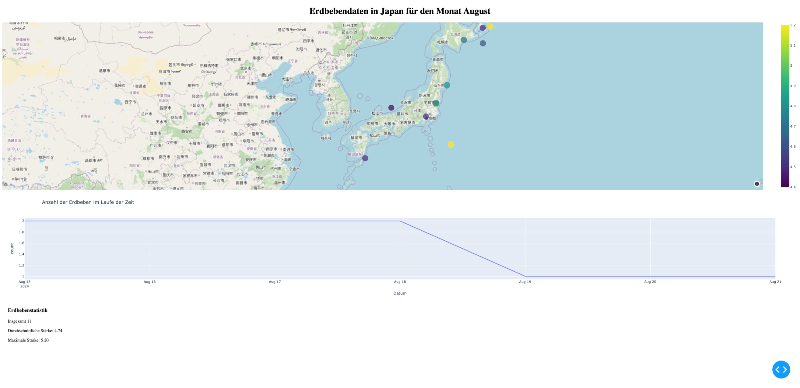

# Earthquake_report

     

Das ist ein kleines Übungsprojekt von mir welches die neulich erschienen Erdbeben in Japan für den Monat August 2024 als Dashboard visualisiert.

### Verwendete Technologie
* Python3
* Dash-Bibliothek
* pandas
* numpy
* OpenStreetMap

## Abbildungen

## Hinweis
Das Dashboard muss im Browser extern geöffnet auf folgender Port 8050.

### Disclaimer:
Ich besitze die bereitgestellte Niederschlagsdaten nicht, die wurden von den earthquake.usgs.gov zu Verfügung gestellt.

* Link: https://earthquake.usgs.gov/earthquakes/map/?extent=11.95335,91.23047&extent=56.46249,188.96484&range=search&timeZone=utc&search=%7B%22name%22:%22Search%20Results%22,%22params%22:%7B%22starttime%22:%222024-08-15%2000:00:00%22,%22endtime%22:%222024-08-22%2023:59:59%22,%22maxlatitude%22:45.188,%22minlatitude%22:28.768,%22maxlongitude%22:151.172,%22minlongitude%22:129.023,%22minmagnitude%22:2.5,%22eventtype%22:%22earthquake%22,%22orderby%22:%22time%22%7D%7D

## Icons
Link: https://www.flaticon.com/free-icon/seismic_4016846?related_id=4016846
